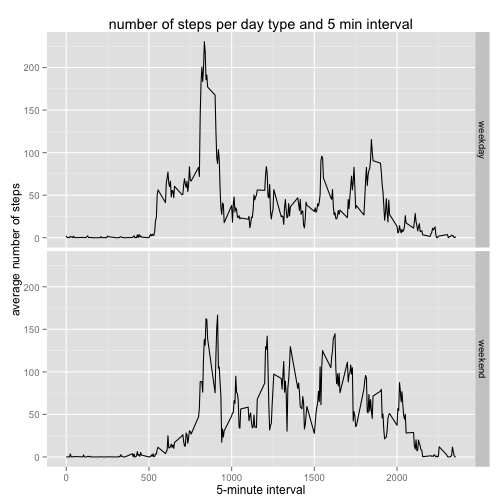

It is now possible to collect a large amount of data about personal movement using activity monitoring devices such as a Fitbit, Nike Fuelband, or Jawbone Up. These type of devices are part of the “quantified self” movement – a group of enthusiasts who take measurements about themselves regularly to improve their health, to find patterns in their behavior, or because they are tech geeks. But these data remain under-utilized both because the raw data are hard to obtain and there is a lack of statistical methods and software for processing and interpreting the data.

This assignment makes use of data from a personal activity monitoring device. This device collects data at 5 minute intervals through out the day. The data consists of two months of data from an anonymous individual collected during the months of October and November, 2012 and include the number of steps taken in 5 minute intervals each day.

**Loading and preprocessing the data**

1) Load the data (i.e. read.csv())

2) Process/transform the data (if necessary) into a format suitable for your analysis

```r
data_url <- "/Users/alver/Downloads/activity.csv"
df_act <- read.csv(file = data_url, header = TRUE, stringsAsFactors = FALSE)
str(df_act)
```

```
## 'data.frame':	17568 obs. of  3 variables:
##  $ steps   : int  NA NA NA NA NA NA NA NA NA NA ...
##  $ date    : chr  "2012-10-01" "2012-10-01" "2012-10-01" "2012-10-01" ...
##  $ interval: int  0 5 10 15 20 25 30 35 40 45 ...
```

```r
head(df_act)
```

```
##   steps       date interval
## 1    NA 2012-10-01        0
## 2    NA 2012-10-01        5
## 3    NA 2012-10-01       10
## 4    NA 2012-10-01       15
## 5    NA 2012-10-01       20
## 6    NA 2012-10-01       25
```


**What is mean total number of steps taken per day?**

For this part of the assignment, you can ignore the missing values in the dataset.

1) Calculate the total number of steps taken per day

```r
TotalStepsPerDay <- tapply(df_act$steps, df_act$date, sum)
```

2) Make a histogram of the total number of steps taken each day

```r
hist(TotalStepsPerDay, main = "the total number of steps taken per day", 
    xlab = "Total number of steps taken per day", ylab = "Days")
```

 

3) Calculate and report the mean 

```r
mean(TotalStepsPerDay, na.rm=TRUE)
```

```
## [1] 10766
```
and median of the total number of steps taken per day

```r
median(TotalStepsPerDay, na.rm=TRUE)
```

```
## [1] 10765
```


**What is the average daily activity pattern?**

1) Make a time series plot (i.e. type = "l") of the 5-minute interval (x-axis) 
and the average number of steps taken, averaged across all days (y-axis)

```r
aggdata <-aggregate(steps~interval, df_act, FUN=mean, na.rm=TRUE)
plot(aggdata$interval, aggdata$steps, type = "l",
     xlab = "5-minute interval", ylab = "average number of steps")
```

 

2) Which 5-minute interval, on average across all the days in the dataset, contains the maximum number of steps?

```r
s= which.max(aggdata$steps)
print(paste("The maximum number of steps contain", aggdata$interval[s], "interval"))
```

```
## [1] "The maximum number of steps contain 835 interval"
```


**Imputing missing values**

Note that there are a number of days/intervals where there are missing values (coded as NA). The presence of missing days may introduce bias into some calculations or summaries of the data.

1) Calculate and report the total number of missing values in the dataset (i.e. the total number of rows with NAs)

```r
sum(is.na(df_act))
```

```
## [1] 2304
```

2) Devise a strategy for filling in all of the missing values in the dataset. The strategy does not need to be sophisticated. 
I will use the mean for that 5-minute interval.

```r
#get mean values for every intervals
df_act_woNA <- na.omit(df_act)
MeanStepsPerInterval <- tapply(df_act_woNA$steps, df_act_woNA$interval, mean)
#form two vectors
steps_vector <- as.vector(MeanStepsPerInterval)
interval_vector <- as.vector(dimnames(MeanStepsPerInterval))
interval_vector <- unlist(interval_vector)
interval_vector <- strtoi(interval_vector)
```


3) Create a new dataset that is equal to the original dataset but with the missing data filled in.

```r
df_act_new <- df_act 
for (i in 1:nrow(df_act_new)) #nrow(df_act_new) 
    {
    if (is.na(df_act_new$steps[i])) 
        {
            # get the interval for NA value
            intrv <- df_act_new$interval[i]
            # get the mean value of steps for interval
            st <- steps_vector[match(intrv, interval_vector)]
            # change the NA value
            df_act_new$steps[i] <- st
        }       
    }
```

4) Make a histogram of the total number of steps taken each day and Calculate and report the mean and median total number of steps taken per day. 

```r
TotalStepsPerDay_new <- tapply(df_act_new$steps, df_act_new$date, sum)
hist(TotalStepsPerDay_new, main = "the total number of steps taken per day", 
    xlab = "Total number of steps taken per day", ylab = "Days")
```

 

```r
mean(TotalStepsPerDay_new, na.rm=TRUE)
```

```
## [1] 10766
```

```r
median(TotalStepsPerDay_new, na.rm=TRUE)
```

```
## [1] 10766
```

Do these values differ from the estimates from the first part of the assignment? What is the impact of imputing missing data on the estimates of the total daily number of steps?

The maen value slightly changed (per 1) median is the same.

**Are there differences in activity patterns between weekdays and weekends?**

For this part the weekdays() function may be of some help here. Use the dataset with the filled-in missing values for this part.

1) Create a new factor variable in the dataset with two levels – “weekday” and “weekend” indicating whether a given date is a weekday or weekend day.


```r
day_vector <- vector(mode="character", length=nrow(df_act_new))
day <- c("weekday", "weekend")
day <- factor(day)
day_vector <- weekdays(as.Date(df_act_new$date))
day_vector[day_vector == "Saturday"]<-"weekend"
day_vector[day_vector == "Sunday"]<-"weekend"
day_vector[day_vector != "weekend"]<-"weekday"

df_final <- cbind(df_act_new, day_vector)
head(df_final)
```

```
##     steps       date interval day_vector
## 1 1.71698 2012-10-01        0    weekday
## 2 0.33962 2012-10-01        5    weekday
## 3 0.13208 2012-10-01       10    weekday
## 4 0.15094 2012-10-01       15    weekday
## 5 0.07547 2012-10-01       20    weekday
## 6 2.09434 2012-10-01       25    weekday
```

2) Make a panel plot containing a time series plot (i.e. type = "l") of the 5-minute interval (x-axis) and the average number of steps taken, averaged across all weekday days or weekend days (y-axis). See the README file in the GitHub repository to see an example of what this plot should look like using simulated data.

```r
aggdata_new <-aggregate(steps~interval + day_vector, df_final, FUN=mean, na.rm=TRUE)

library(ggplot2)
p <- qplot(interval, steps, data=aggdata_new, type = 'l', geom=c("line"),
   facets=day_vector~., main = "number of steps per day type and 5 min interval",
   xlab = "5-minute interval", ylab = "average number of steps")

p + theme(axis.title=element_text(), legend.position="top") 
```

 

